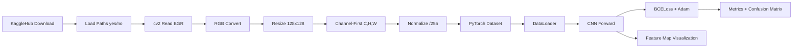
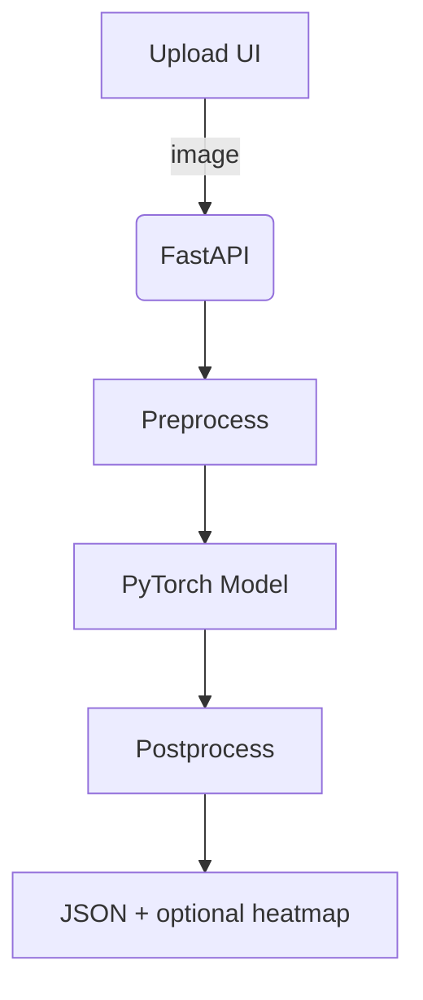

# MRI Brain Tumor Detection — Feature Map and Enhancement Roadmap

This document provides a deep dive into the implementation in `MRI-Brain-Tumor-Detecor.ipynb`, a full pipeline map, current features and results, and a prioritized roadmap to evolve this into a production-ready API with a future frontend.

## Repository Overview

- `MRI-Brain-Tumor-Detecor.ipynb` — main notebook: dataset download, preprocessing, training, evaluation, and feature-map visualization
- `README.md` — setup and quickstart
- `requirements.txt` — dependencies
- `.gitignore` — ignores datasets, binaries, caches, and artifacts
- `kaggle_cache/` — local dataset cache via KaggleHub (ignored by Git)

## End-to-End Pipeline

1. Dataset acquisition with KaggleHub
   - Uses handle `navoneel/brain-mri-images-for-brain-tumor-detection`
   - Cache rooted at `./kaggle_cache` via `KAGGLEHUB_CACHE`
   - Two classes under `brain_tumor_dataset/yes` and `brain_tumor_dataset/no`
2. Image preprocessing (OpenCV)
   - Read with `cv2.imread()` (BGR), convert to RGB via channel swap
   - Resize to `128x128`
   - Reshape to channel-first `(C,H,W)` for PyTorch
   - Normalize by dividing pixel values by 255.0
3. Dataset class `MRI(Dataset)`
   - Aggregates arrays for images and labels
   - `__len__` / `__getitem__` return dict: `{ 'image': tensor, 'label': tensor }`
   - Enhanced version includes:
     - `train_val_split()` using `train_test_split(..., test_size=0.20, random_state=42)`
     - `mode` flag to switch between train/val sets
4. Dataloaders
   - `DataLoader(..., batch_size=32, shuffle=True)` for training
   - `shuffle=False` for evaluation
5. Model: `class CNN(nn.Module)`
   - Convolutional stem (`nn.Sequential`):
     - `Conv2d(3, 6, kernel_size=5)` → `Tanh()` → `AvgPool2d(kernel_size=2, stride=5)`
     - `Conv2d(6, 16, kernel_size=5)` → `Tanh()` → `AvgPool2d(kernel_size=2, stride=5)`
   - Fully connected head (`nn.Sequential`):
     - `Linear(256, 120)` → `Tanh()`
     - `Linear(120, 84)` → `Tanh()`
     - `Linear(84, 1)` → sigmoid output
   - Forward:
     - Flatten conv features and return `F.sigmoid(x)`
6. Training
   - Optimizer: `Adam(lr=1e-4)`
   - Epochs: `EPOCH = 400`
   - Loss: `nn.BCELoss()` with `y_hat.squeeze()` vs `label`
   - Device-aware (`cuda` if available)
7. Evaluation
   - Collects predictions on the dataset with `torch.no_grad()`
   - Metrics: `accuracy_score`, `confusion_matrix` (sklearn)
   - Visualization: seaborn heatmap for confusion matrix
8. Visualization
   - Feature maps of the convolutional layers
   - Random sample images and prediction distributions

## Dataset Details

- Source: Kaggle (`navoneel/brain-mri-images-for-brain-tumor-detection`)
- Classes: `yes` (tumor), `no` (healthy)
- Total images: 245 (approx. 154 yes, 91 no as per dataset listing)
- Format: JPG
- Image size: resized to 128x128
- Channel order: RGB (converted from OpenCV BGR)

## Model and Training Configuration

- CNN with 2 conv blocks (Tanh + AvgPool) and 3 dense layers
- Optimizer: Adam, `lr=1e-4`
- Epochs: 400
- Batch size: 32
- Loss: binary cross-entropy (`nn.BCELoss`)
- Output activation: sigmoid
- Potential class imbalance (yes > no)

## Results (from notebook)

- Reported accuracy: ~100% on both train and test/eval passes
- Confusion matrix shows perfect separation in the sampled run
- Note: Very small dataset makes 100% accuracy suspect for generalization; requires robust validation

## Observations and Risks

- Small dataset (245 images) can cause overfitting
- Pooling stride of 5 is unconventional and may be overly aggressive
- Tanh activations are less common than ReLU/SiLU with modern initializations
- Evaluation sometimes mixes the full dataset; careful train/val/test separation needed
- Class imbalance should be explicitly addressed

## Immediate Improvements (Modeling & Data)

- Data augmentation (random flips/rotations, brightness/contrast, slight affine, Cutout)
- Proper splits: train/val/test with stratification; avoid leakage
- Add `BatchNorm2d` and replace Tanh with ReLU/LeakyReLU
- Replace AvgPool(stride=5) with MaxPool(stride=2) or use stride in convs
- Early stopping, model checkpointing on best val metric
- Class weighting or `WeightedRandomSampler` for imbalance
- Track ROC-AUC, precision/recall, F1, and calibration (ECE)
- Use a stronger backbone (e.g., ResNet18/34) with transfer learning

## Engineering Improvements

- Refactor into package modules:
  - `src/data.py` (dataset, transforms, augmentations, splits)
  - `src/model.py` (CNN/backbone factory)
  - `src/train.py` (loops, metrics, checkpoints, early stop)
  - `src/infer.py` (preprocess + predict API)
- Configuration via `yaml` (hydra/omegaconf) for reproducibility
- Deterministic seeds and `torch.backends.cudnn.deterministic`
- Logging: `logging` + tensorboard/wandb option
- Tests: unit tests for dataset/model and a tiny integration smoke test
- Packaging: `pyproject.toml` (build), CLI entry points for train/infer

## API Plan (FastAPI)

Endpoints:
- `GET /healthz` → `{ status: 'ok' }`
- `POST /predict` (multipart/form-data image)
  - Response: `{ label: 'tumor'|'healthy', prob: float, latency_ms: int }`
- `POST /explain` (optional) → Grad-CAM heatmap overlay

Inference flow:
1. Validate content-type and size
2. Decode and preprocess (match training: resize 128x128, RGB, normalize)
3. Model forward pass
4. Threshold at 0.5 (configurable), return label + probability

Non-functional:
- Add request size limits and timeouts
- Structured logs and correlation IDs
- `/metrics` for Prometheus (optional)

## Frontend Plan

- Minimal web UI: drag-and-drop/upload → show predicted class, probability
- Optional overlay: Grad-CAM heatmap on the MRI
- UX: show confidence, disclaimers, and a clear “not for clinical use” banner

## Reproducibility & Deployment

- Seed all RNGs; pin versions in `requirements.txt`
- Export model to `.pt` (and optionally ONNX for CPU-only serving)
- Dockerfile for API service; CI to build and run tests
- Deployment targets: local, Azure/AWS/GCP, or Render/Fly.io for demos

## Roadmap (Milestones)

- [ ] Refactor notebook into `src/` modules
- [ ] Implement augmentations and stratified splits
- [ ] Train ResNet18 transfer learning baseline
- [ ] Add early stopping and best-checkpoint saving
- [ ] Implement CLI: `train.py` and `infer.py`
- [ ] Package FastAPI app with `/predict` and `/healthz`
- [ ] Add Grad-CAM explainability endpoint
- [ ] Create Dockerfile + CI workflow
- [ ] Frontend upload UI
- [ ] Benchmark latency and memory; add metrics & logs

## References

- Kaggle dataset: `navoneel/brain-mri-images-for-brain-tumor-detection`
- PyTorch, torchvision, scikit-learn, OpenCV
- FastAPI, Uvicorn for serving
